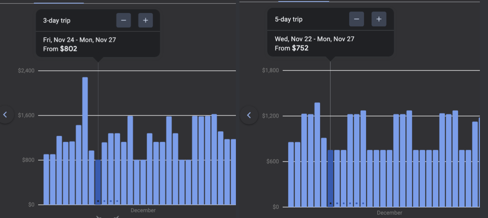
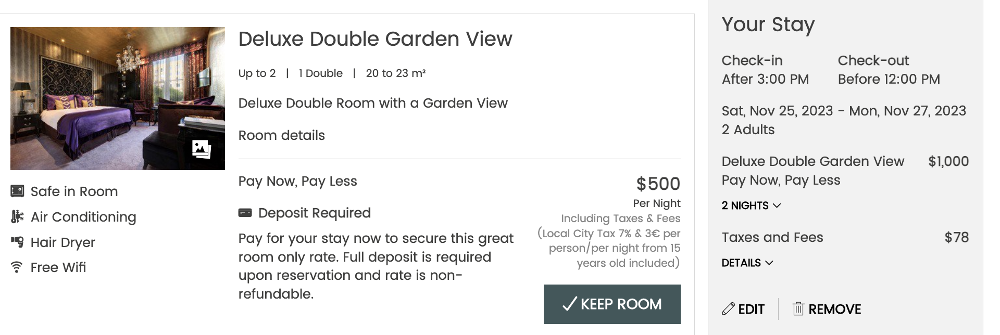

Academic Holidays

<!--<blockquote style="color: yellow; background:">
<a href="https://www.amsterdam.info/red-light-district/" style="color: Purple; text-decoration:text-decoration-style: dotted;">Red Light District -- Torture Museum</a>
-->

# Labor Day Break
>Monday September 4th, 2023   
  

# Fall Break   
>Monday October 23, 2023 - Tuesday October 24, 2023   

 <li>test</li>
 <li>test2</li>
   
   

$$
\begin{aligned}
\text{some math i guess } \\    
\alpha &= \underset{\theta\in\Theta_0}{\sup}\space \beta(\theta) \\
\end{aligned}
$$

$$\boxed{K_{k+1}=P_ka_{k+1}^T(a_{k+1}P_ka_{k+1}^T+I_N)^{-1}}$$

# Thanksgiving Break

Wednesday November 22, 2023 - Saturday November 25th, 2023

<b>I. To Visit</b>
>
> Attractions
>1. <h4><a href="https://www.escherinhetpaleis.nl/?lang=en" style="color: Purple; text-decoration:text-decoration-style: dotted;">Escher Museum</a></h4>
>
>            Tickets: €10.50 (≈$11.34)
>            Hours: Tuesday to Sunday 11:00 AM - 5:00 PM
>   2. <h4><a href="https://sexmuseumamsterdam.nl/karte_ticket/" style="color: Purple; text-decoration:text-decoration-style: dotted;">Sex Museum</a></h4>
>
>            Tickets: €10 (≈$10.80)
>            Hours: 10:00 AM - 6:00 PM
>   3. <h4><a href="https://www.amsterdam.info/red-light-district/" style="color: Purple; text-decoration:text-decoration-style: dotted;">Red Light District -- Torture Museum</a></h4>
>
>            Tickets: €7.50 (≈$8.10)
>            Hours: Daily 10:00 AM - 11:00 PM
>
>   

Other Ideas

>
>*Explore other parts like Flower market too*
>
>
> Organizations
>
> 5. <a href="https://www.uva.nl/en" style="color: Purple; text-decoration:text-decoration-style: dotted;">University of Amsterdam</a>
>
> 6. <a href="flowtraders.com" style="color: Purple; text-decoration:text-decoration-style: dotted;">Trading Firms</a>
>
> 

>
>
 

<b>II. Flights</b>
<blockquote>

3 Day Flight vs.5 Day Flight

 

</blockquote>

<b>III. Hotels</b>
<blockquote>

3 Day Stay

</blockquote>

